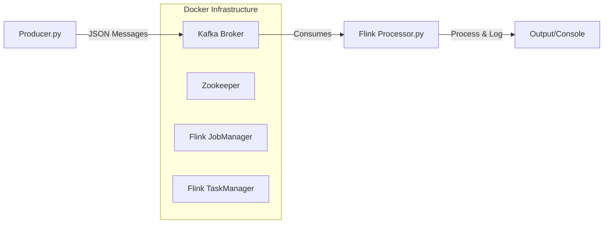

# Flink + Kafka Streaming Pipeline

This project implements a real-time streaming pipeline using **Apache Kafka** and **Apache Flink (PyFlink)**. It demonstrates a complete producer-processor workflow running in a Dockerized environment.

## 🚀 Overview

The pipeline consists of:
1.  **Kafka Producer**: A Python script that generates dummy sensor data (temperature, humidity) and publishes it to a Kafka topic.
2.  **Apache Kafka**: The message broker acting as the streaming platform.
3.  **Flink Processor**: A PyFlink application that consumes data from Kafka, processes it (simple deserialization and logging), and runs as a streaming job.

## 🏗️ Architecture



### Components
-   **Zookeeper**: Coordinates the Kafka brokers.
-   **Kafka**: Runs on port `9092` (internal) and `29092` (host).
-   **Flink Cluster**: Consists of a JobManager (Web UI on `8082`) and a TaskManager.

## 📋 Prerequisites

-   **Docker** & **Docker Compose**
-   **Python 3.8+**
-   **Java 11** (Required for local PyFlink execution)

## 🛠️ Setup & Installation

1.  **Clone/Open the project directory:**
    ```bash
    cd /home/dflorjan/Documents/daeng
    ```

2.  **Start the Infrastructure:**
    Spin up the Kafka and Flink containers using Docker Compose.
    ```bash
    docker-compose up -d
    ```
    *Wait a few seconds for containers to fully initialize.*

3.  **Initialize Environment:**
    Run the setup script to create a virtual environment, install dependencies, and download the required Flink connector JAR.
    ```bash
    chmod +x setup.sh
    ./setup.sh
    ```

4.  **Activate Virtual Environment:**
    ```bash
    source venv/bin/activate
    ```

## ▶️ Usage

### 1. Run the Producer
Start the producer to begin sending data to the `input-topic`.
```bash
python3 producer.py
```
*You should see logs indicating messages are being sent.*

### 2. Run the Processor
In a separate terminal (don't forget to activate `venv`), start the Flink job.
```bash
python3 processor.py
```
*You should see the processed data being printed to the console.*

### 3. Flink Dashboard
Monitor your running jobs and cluster status at:
[http://localhost:8082](http://localhost:8082)

## 🐛 Troubleshooting

-   **NoBrokersAvailable**: Ensure the Docker containers are running (`docker-compose ps`). The producer automatically retries, but if it fails persistently, check container logs.
-   **Port Conflicts**:
    -   Kafka uses port `29092` on the host.
    -   Flink UI uses port `8082` (changed from default 8081).
-   **Missing JAR**: Ensure `flink-sql-connector-kafka-4.0.0-2.0.jar` is present in the project root. If not, re-run `./setup.sh`.

## 📂 Project Structure

-   `docker-compose.yml`: Infrastructure configuration.
-   `producer.py`: Python Kafka producer script.
-   `processor.py`: PyFlink streaming job script.
-   `setup.sh`: Automated setup script.
-   `requirements.txt`: Python dependencies.
